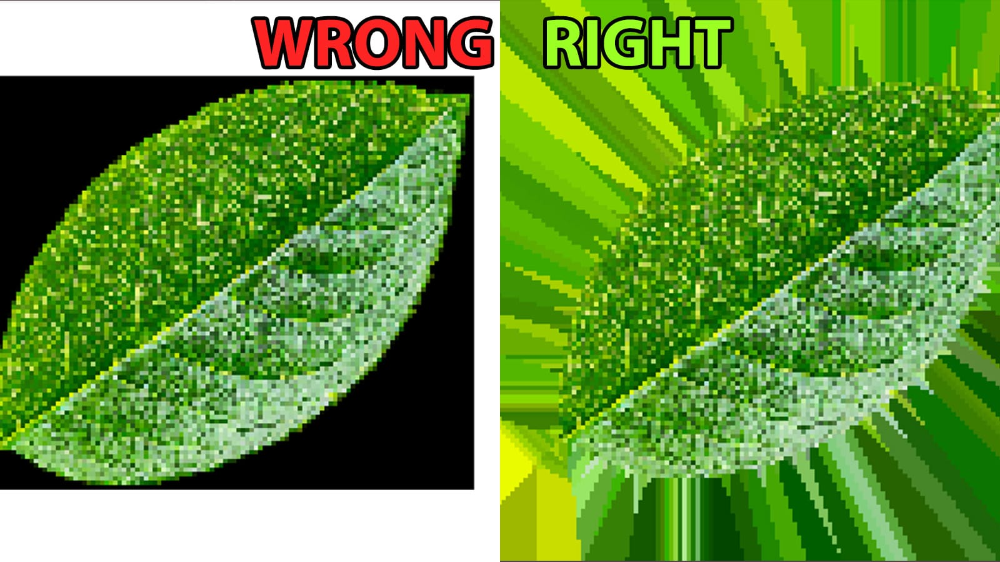
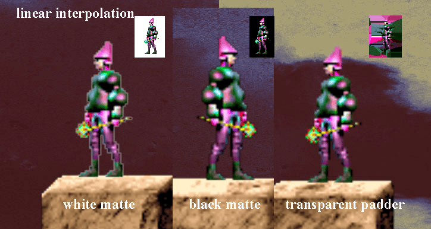

***DISCLOSURE:*** The original gui application this was forked from was made into a command-line utility with Claude Sonnet 4, along with the bulk of this documentation. Default output (TGA) and PNG output have been tested (`python pad_alpha.py input.png -o output.png`)

# Transparent-Padder

Contains a tool to correctly pad a transparent texture for use in game engines 
Transparent textures sometimes have garbage unrelated RGB values in the areas that transparent. In game engines this can lead to visual artifacts wherever the shader has to sample and average based on neighboring pixels of a opaque pixel. An example is mips. The code here takes a png with transparency and generates a TGA with actual alpha, where the RGB values surrounding the opaque pixels are correctly padded. You can also use it to generally pad between UV islands of a normal texture. The texture is saved next to whatever image you provided.

It is also useful when linearly interpolating textures in a 2D context. 

Note: The larger the image, the longer it takes, give it time.

You can read more here: https://medium.com/@shahriyarshahrabi/padding-transparent-textures-fir-mips-and-game-engines-c71c085142fe

To get the .exe, go here (was made with pyinstaller): https://github.com/IRCSS/Transparent-Padder/releases/tag/v1



## Usage Options

This tool is available in two versions:

To run the GUI version:
```bash
python pad_alpha_gui.py
```

### Command-Line Version
Batch-processing friendly command-line utility for automation and workflows.

#### Installation
Requires Python 3.6+ with the following dependencies:
```bash
pip install pillow numpy scipy
```

#### Basic Usage
```bash
# Basic padding with auto-set parameters
python pad_alpha.py image.png

# Specify custom output file
python pad_alpha.py image.png -o padded_result.tga

# Custom parameters
python pad_alpha.py image.png -r 5 -s 2.0

# UV island mode with mask
python pad_alpha.py texture.png -m island_mask.png

# Verbose output to see processing details
python pad_alpha.py image.png --auto -v
```

#### Command-Line Options
```
positional arguments:
  input                 Input image file (PNG, TGA, TIFF, BMP)

options:
  -h, --help            Show help message and exit
  -o, --output OUTPUT   Output file path (default: input_padded.tga)
  -r, --radius RADIUS   RGB averaging radius (default: auto or 3)
  -s, --sigma SIGMA     Alpha blur sigma for edge smoothing (default: auto or 3.0)
  -m, --mask MASK       UV island mask image (enables UV texture mode)
  --auto               Auto-set parameters based on image resolution
  -v, --verbose        Verbose output
```

#### Parameter Guide
- **Radius**: Controls the neighborhood size for RGB averaging. Higher values create smoother transitions but take longer to process. Typical range: 2-10.
- **Sigma**: Controls alpha edge blur smoothness. Higher values create softer transparency transitions. Typical range: 1.0-5.0.
- **Auto mode**: Automatically calculates optimal parameters based on image resolution (recommended for most use cases).

#### Examples
```bash
# Process a game sprite with auto parameters
python pad_alpha.py character_sprite.png --auto -v

# Batch process with specific settings
python pad_alpha.py ui_element.png -r 4 -s 1.5 -o assets/ui_element_padded.tga

# UV texture with island mask
python pad_alpha.py character_diffuse.png -m character_uv_mask.png -o character_diffuse_padded.tga

# Quick processing with minimal blur
python pad_alpha.py icon.png -r 2 -s 0.5
```

#### Integration with Build Scripts
The command-line version is perfect for integration into asset processing pipelines:

```bash
# Bash script example
for file in textures/*.png; do
    echo "Processing $file..."
    python pad_alpha.py "$file" --auto
done

# Process with specific naming convention
python pad_alpha.py raw/texture.png -o processed/texture_game_ready.tga
```

## Output
Both versions save the processed image as a TGA file with proper alpha channel next to the input image (unless a custom output path is specified). The RGB values in transparent areas are filled with intelligently averaged colors from nearby opaque pixels, eliminating sampling artifacts in game engines and mip-mapping.
